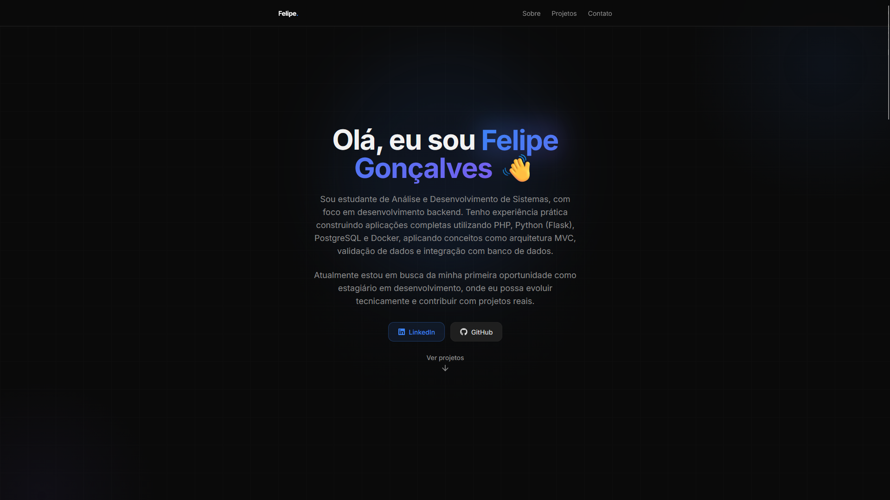

# 🚀 Portfólio — Felipe Gonçalves

Este repositório contém meu portfólio como desenvolvedor backend em formação, apresentando projetos práticos focados na construção de aplicações reais, desde a estruturação até a integração com banco de dados.



---

## 👨‍💻 Sobre mim

Sou estudante de Análise e Desenvolvimento de Sistemas, com formação técnica em Informática pela ETEC de Vila Formosa.

Tenho foco em desenvolvimento backend e venho estudando na prática como sistemas são construídos do zero até o deploy, utilizando tecnologias como PHP, Python (Flask), PostgreSQL e Docker.

Gosto de aprender desenvolvendo projetos reais, enfrentando desafios como:
- Integração com banco de dados
- Organização de código e arquitetura
- Estruturação de aplicações completas

Atualmente, estou em busca da minha primeira oportunidade como estagiário em desenvolvimento, com o objetivo de evoluir tecnicamente e contribuir com projetos reais.

---

## 🛠️ Tecnologias utilizadas no portfólio

### Frontend
- React (com TypeScript)
- Vite
- Tailwind CSS

### Estrutura e organização
- Componentização (React)
- Separação por seções (Hero, About, Projects, Contact)
- Hooks personalizados

### Outros
- ESLint
- PostCSS

---

## 💼 Projetos em destaque

### 🔐 Sistema de Autenticação (PHP)

Sistema completo de autenticação de usuários, desenvolvido com foco em boas práticas de backend e segurança.

#### Funcionalidades
- Cadastro e login de usuários
- Validação de dados no frontend e backend
- Hash de senha para segurança
- Estrutura organizada em MVC

#### Aprendizados
- Organização de backend com MVC
- Integração com PostgreSQL via PDO
- Boas práticas de segurança em autenticação
- Estruturação de aplicações web completas

🔗 Acesse o projeto: *(coloque aqui o link do GitHub)*

---

### 🏪 Sistema de Gestão para Loja de Acrílicos

Sistema de gerenciamento desenvolvido para simular um ambiente real de negócio, com controle de clientes, pedidos e operações internas.

#### Funcionalidades
- Cadastro e gerenciamento de clientes
- Controle de pedidos
- Estrutura de API REST
- Arquitetura MVC
- Controle de usuários e permissões

#### Aprendizados
- Construção de APIs com Flask
- Uso de SQLAlchemy para ORM
- Integração entre backend e banco de dados
- Estruturação de sistemas maiores
- Containerização com Docker

🔒 Projeto desenvolvido em ambiente privado por envolver dados de uma empresa real.  
Disponível para demonstração mediante solicitação.

---

## 🎯 Objetivo do portfólio

Este portfólio foi desenvolvido com o objetivo de:

- Consolidar conhecimentos em desenvolvimento backend
- Aplicar boas práticas de arquitetura e organização de código
- Trabalhar com integração de banco de dados e APIs
- Simular cenários reais de desenvolvimento

---

## ⚙️ Execução do projeto

```bash
# Clonar o repositório
git clone https://github.com/seu-usuario/seu-repositorio.git

# Acessar a pasta
cd seu-repositorio

# Instalar dependências
npm install

# Rodar o projeto
npm run dev
```

🎨 Interface e desenvolvimento

A interface do portfólio foi estruturada com auxílio da ferramenta Lovable, sendo posteriormente ajustada e refinada manualmente, incluindo melhorias de layout, organização de componentes, conteúdo e responsividade.

---

🟢 Projeto finalizado e em constante evolução
